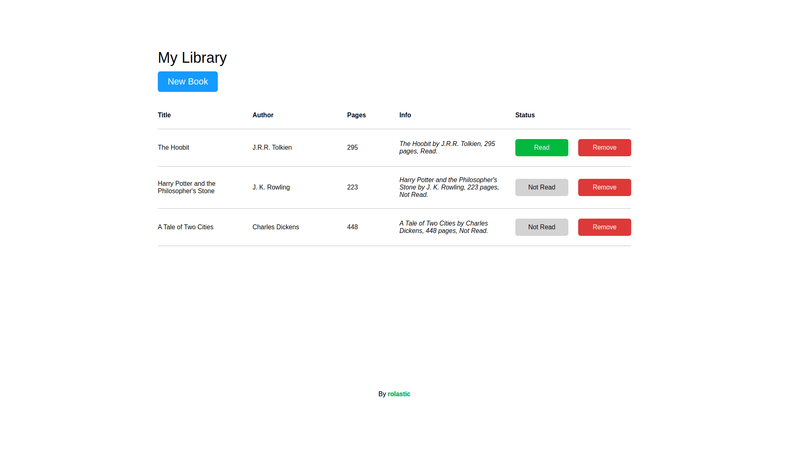

# Library

## [Live Preview](https://rolastic.github.io/Library/)

The goal of this simple project is to showcase the usage of object constructors and prototypes.

### Features
- A function that loops through the array and displays each book prototype on the page
- A form that allows the user to add new books
- A button to change the read status of the book
- A delete button

